# Plataforma Web - Oficios

## Introducción

Al momento de redactar este manual, los oficios se escriben e imprimen en papel, los cuales son sellados y firmados con firma autógrafa, y cuando los destinatarios son foráneos son enviados por paquetería. Esto causa altos costos económicos y consume tiempo valioso que merma el desempeño de este medio oficial de documentación y comunicación.

El módulo Oficios en Plataforma Web sirve para escribir, firmar, enviar y administrar los oficios que se elaboran y se envían entre los juzgados y las direcciones de nuestra institución. Con su uso vamos a alcanzar la meta de “cero papel” en la Ciudad Judicial de Saltillo y en todos los Distritos Judiciales, porque ya no habrá la necesidad de imprimir y enviar físicamente estos documentos.

Además se va a incrementar la eficiencia en la gestión, habrá más confianza por medio de la firma electrónica, mayor seguridad y seguimiento por los controles de acceso y menores riesgos gracias a los respaldos de la información.

## Objetivo

- Alcanzar la meta de "cero papel" donde se busca eliminar el uso del papel en las operaciones administrativas, promoviendo la digitalización de documentos y el uso de sistemas para la gestión de información con firma electrónica y realizando envíos por medios electrónicos.

## Beneficios

- Reducir los costos
- Agilizar los procesos
- Disminuir el almacenamiento físico

## Cuenta en Plataforma Web

Plataforma Web concentra un gran número de servicios y administra información interna y pública. Además la mayoría de los usuarios la usa para descargar sus recibos de nómina y para crear tickets de soporte técnico. Para usar el módulo Oficios es necesario que la plataforma tenga correctos los siguientes datos:

- Nombre completo
- Puesto
- Autoridad (juzgado, dirección, unidad o área)
- Correo electrónico pjecz.gob.mx o coahuila.gob.mx

Puede verificar esta información en el menú izquierdo, de clic en su correo y luego en Perfil. Si está equivocada, incompleta o ha cambiado, levante un ticket de soporte.

## Elementos de los oficios

Cada oficio es único y tiene estos componentes:

- **Descripción:** En pocas palabras de qué trata el oficio. Si se aprovecha bien será muy útil con el buscador. Por ejemplo: _REQUISICION DEL SERVICIO DE PROVEEDOR MES AÑO_.
- **Folio:** Identificador formado por la clave de la autoridad, el número, diagonal y año.
- **Contenido:** Texto del oficio que se guarda en HTML.
- **Archivos adjuntos:** Cuando se necesite anexar un archivo PDF, DOCX, XLSX o PDF, e imágenes en JPG o PNG. No es obligatorio que los tenga.
- **Destinatarios:** Usuarios de Plataforma Web a quienes va dirigido. Cuando el oficio es ENVIADO, aparecerá en la bandeja de entrada de cada uno.
- **Cadena de validación:** Conjunto de caracteres que se forma con el contenido a través de un algoritmo de cifrado. Cualquier cambio en el contenido provocará una cadena diferente, detectando cualquier edición en la base de datos.
- **Tiempo en que fue creado** y **tiempo en que fue firmado:** Los listados se ordenan por el tiempo de creación, del más reciente al más antiguo.

## Roles del módulo Oficios

Hay tres roles que definen las funciones en el módulo Oficios:

- **Oficios Lector:** Todos las cuentas pueden leer oficios y tienen su bandeja de entrada
- **Oficios Escritor:** Además de leer puede crear un nuevo oficio y editar los borradores de su autoridad. No puede firmar pero sí puede enviar un oficio que haya sido firmado.
- **Oficios Firmante:** Todo lo anterior, además de poder firmar.

Para solicitar el rol escritor o firmante, el jefe de la autoridad debe crear un ticket de soporte proporcionando los datos de la cuenta (descritos con anterioridad). Esta solicitud será validada con la información del personal.

## Estados de los oficios

Los oficios pasan por tres etapas o estados:

1. **BORRADOR:** Es la forma inicial de un oficio que se puede editar de forma ilimitada por quienes escriben o firman. Su folio inicial el mayor número de la autoridad en el año más uno; puede cambiarse el número, pero si se hace puede afectar al siguiente folio.
2. **FIRMADO:** Cuando un firmante firma el oficio pasa a este estado donde ya no se puede cambiar su contenido ni el folio. Además se genera un archivo PDF que se puede descargar.
3. **ENVIADO:** Significa que se le ordena al sistema que lo pongo en la bandeja de entrada de los destinatarios. Además de enviar mensajes vía correo electrónico con el URL directo al mismo.

Además, un oficio puede ser

- **CANCELADO:** Si hay un error humano o se necesita revocarlo, se puede cancelar; así cuando se da clic en Mi Bandeja de Entrada o en el URL del mensaje por correo electrónico se verá de inmediato como cancelado.
- **ARCHIVADO:** Cuando se haya concluido su propósito debe ser archivado. Un oficio archivado no se puede cancelar.

## Mi Bandeja de Entrada

De clic en **Oficios** en el menú principal, le mostrará **Mi Bandeja de entrada** con el listado de los oficios que ha recibido. Los oficios que aún no ha leído aparecerán en negritas.

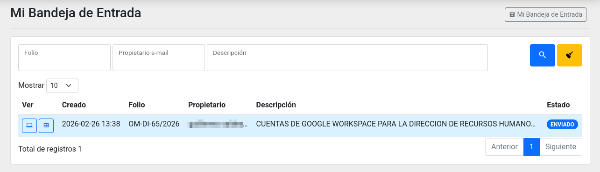

Puede usar el buscador del listado para escribir en éste parte del folio, la clave de la autoridad o parte de la descripción y dar clic en la **lupa** para filtrar sus resultados. De clic en la **escoba** para limpiar los campos.

Para ver un oficio hay dos vistas, la primera es **Ver en Monitor** ideal para computadoras con monitores grandes, la segunda es **Ver en Celular** que es mejor para teléfonos inteligentes.

## Mis Oficios

Los oficios de su "propiedad" se listan en **Mis Oficios**. Aquí aparecen sus borradores y los que haya firmado.

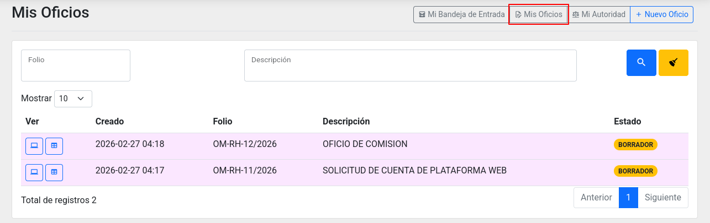

Cuando un oficio es firmado, quien firma será el propietario.

## Mi Autoridad

Para favorecer el trabajo en equipo, los usuarios con roles escritor y firmante pueden consultar todos los oficios de su autoridad. Esto sirve para que más de una persona trabaje en la redacción de los oficios y que puedan buscar y consultar el histórico de los mismos.

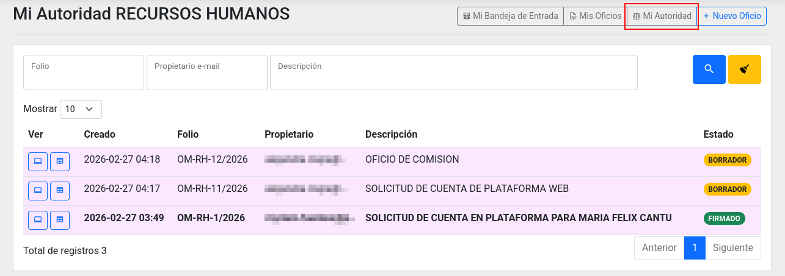

## Ver en Monitor

En esta vista tiene la versión digital del oficio con su encabezado, su cuerpo y su pie de página (con la cadena de validación si está firmado). Del lado derecho superior aparecerán el listado de los archivos adjuntos y del lado derecho inferior el listado de los destinatarios (en azul si no lo ha visto y en verde si ya lo vio).

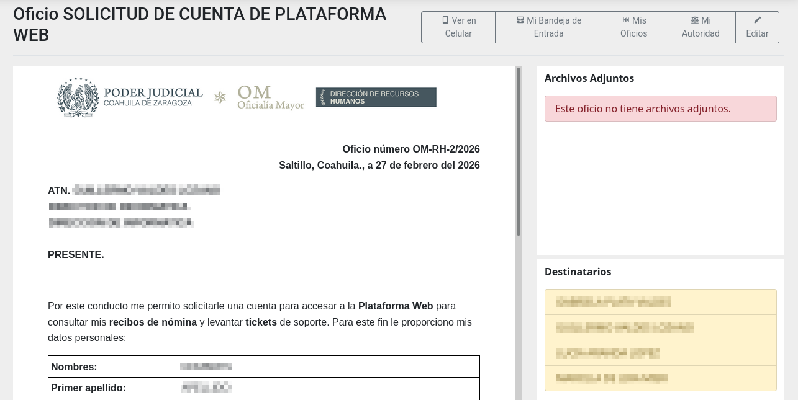

## Ver en Celular

La vista para pantalla pequeña es ideal para teléfonos inteligentes con orientación vertical. El primer cuadro tiene los datos generales y la cadena de validación. Observe que se una comparación entre la cadena de validación guardada y una hecha al vuelo, si son iguales, el contenido está íntegro; si son diferentes, entonces se considera _no válido_ porque se ha cambiado el contenido después de ser firmado.

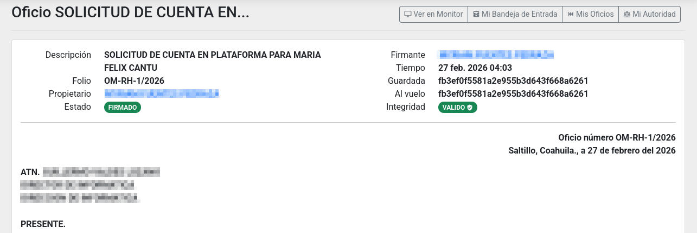

El segundo cuadro tiene el cuerpo del oficio, seguido por las listas de los destinatarios y de los archivos adjuntos.

## Nuevo Oficio

De clic en **Nuevo Oficio** para iniciar un asistente:

1. Elija la autoridad a la que quiere enviar.
2. Elija una plantilla, las primeras son las plantillas compartidas por la autoridad elegida, las segundas son sus propias plantillas. Puede dar clic en Atrás para elegir otra autoridad.
3. Vea la vista previa. Si no es lo que necesita de clic en Atrás. Para crear de clic en Crear.

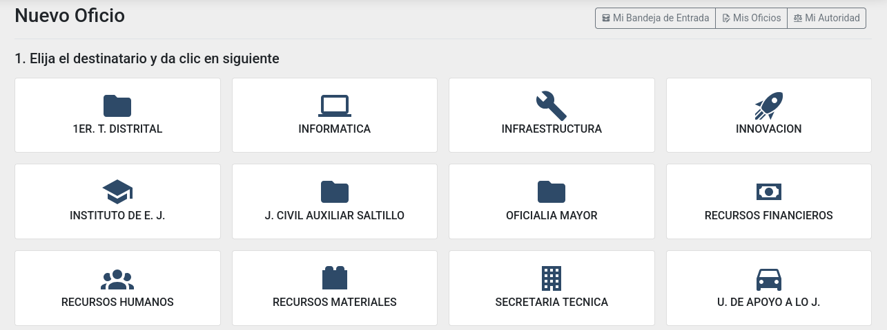

Tendrá a la vista el formulario con estos campos:

- **Descripción:** En pocas palabras de qué trata el oficio. Si se aprovecha bien será muy útil con el buscador. Por ejemplo: _REQUISICION DEL SERVICIO DE PROVEEDOR MES AÑO_.
- **Folio:** Se elabora de forma automática con la clave de la autoridad, el número, una diagonal y el año. Puede cambiar el número. Recuerde que se le ofrecerá el número mayor del año más uno de su autoridad.
- **Contenido:** Texto del oficio que se guarda en HTML.

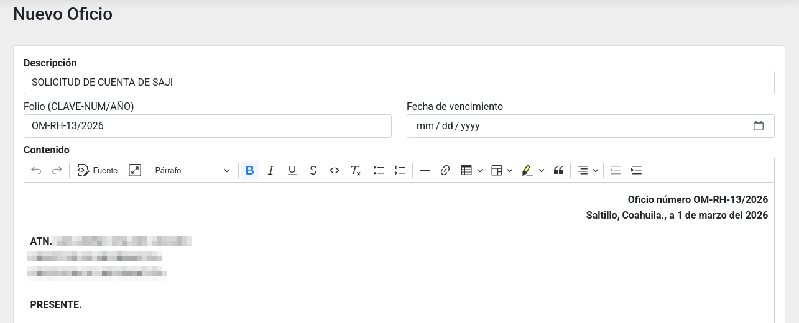

Tenga en cuenta que si toma mucho tiempo en escribir y no guarda su avance, podría perder su escrito porque caduca la sesión en aproximadamente una hora. Le recomendamos que guarde frecuentemente.

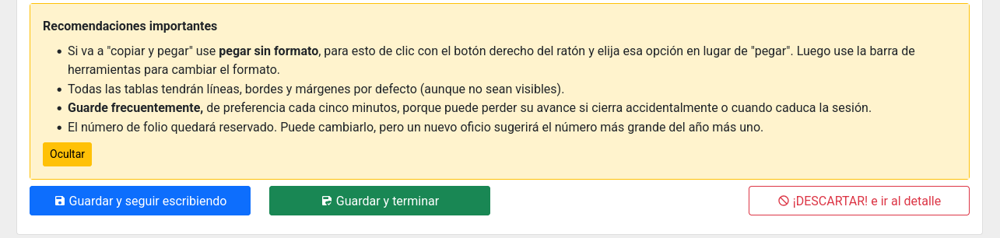

## Editar

Mientras un oficio tenga el estado BORRADOR puede ser editado las veces que necesite por los usuarios con el rol de escritor y firmante.

El editor del contenido permite que la tipografía sea normal, negrita o itálica, puede alinear a la izquierda, al centro, a la derecha o justificar y puede crear tablas sencillas. Cuando guarda se limpia y estandariza para que todos los oficios tengan el mismo tipo de letra y tamaño.

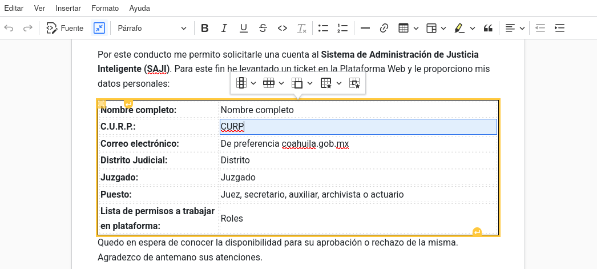

Advertimos que si dos o más usuarios editan el mismo oficio al mismo tiempo, puede haber pérdidas porque no se puede editar de forma simultánea por varios usuarios.

## Agregar Archivos Adjuntos

Adjunte archivos cuando el oficio requiere documentos anexos. De clic en Adjuntar Archivos. Luego en el formulario para este fin, escriba la descripción del anexo, luego de clic en el cuadro para elegir el archivo en una ventana de diálogo, o bien, arrastre y deje caer en el recuadro.

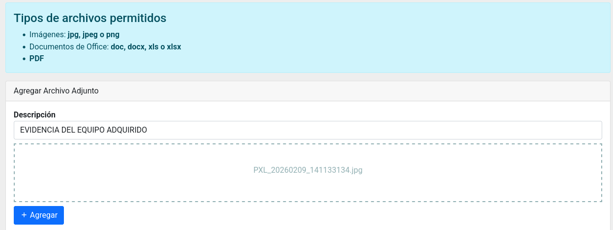

## Agregar Destinatarios

La o las personas usuarias son las que recibirán el oficio en su bandeja de entrada y por un mensaje vía correo electrónico cuando de clic en Enviar. Para agregar de clic en Agregar Personas.

En el formulario, puede agregar una por una escribiendo parte del nombre o del puesto, o bien, puede agregar a todas las personas de una autoridad.

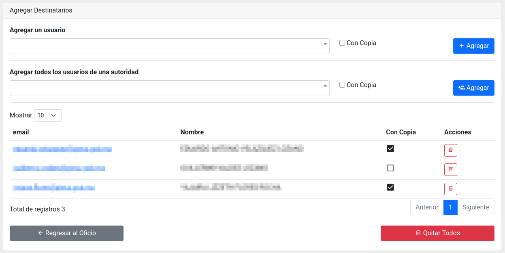

## Firmar

Cuando el oficio en estado BORRADOR esté listo, el o los usuarios con el rol firmante podrán dar clic en firmar, revisar cuidadosamente el contenido y dar clic en Firma Electrónica Simple o Firma Electrónica Avanzada.

Después de unos segundos se creará un archivo PDF que puede descargar para conservar una copia. También el archivo PDF puede servir para enviar vía correo electrónico.

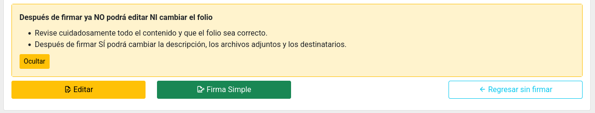

## Enviar

Un oficio firmado puede ser enviado, así que quien tenga el rol firmante o escritor puede hacer clic en el botón enviar. Esto lanzará un procedimiento que enviará mensajes vía correo electrónico y hará que aparezca en Mi Bandeja de Entrada de los destinatarios.

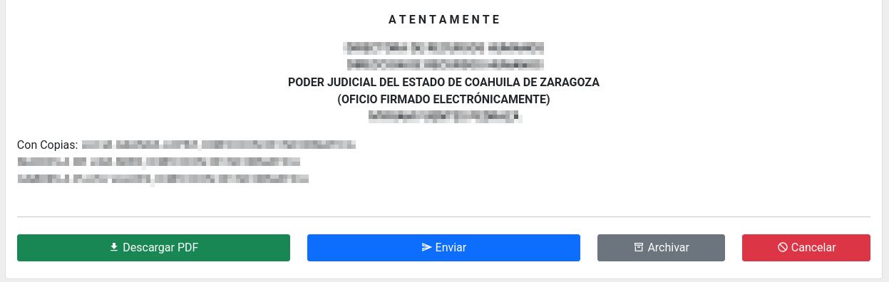

## Cancelar

Si por error humano se tiene la necesidad de cancelar un oficio, de clic en Cancelar. Cuando un oficio en estado BORRADOR es cancelado, se limpia el campo de folio; en cambio, si ya estaba firmado o enviado, conservará su folio.

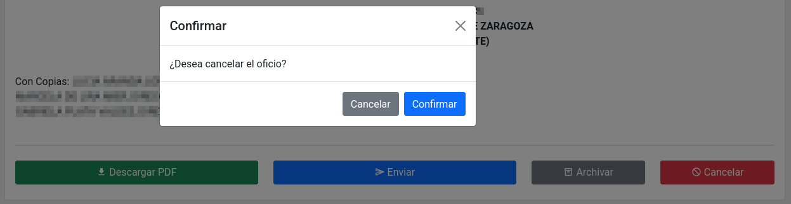

Este diseño evita la destrucción por malicia de la información, ya que todos los oficios, sin cancelar y cancelados se van a conservar tal y como fueron firmados y enviados.

## Archivar

Para proteger un oficio contra la cancelación accidental y declararlo como un asunto concluido, de clic en el botón Archivar.

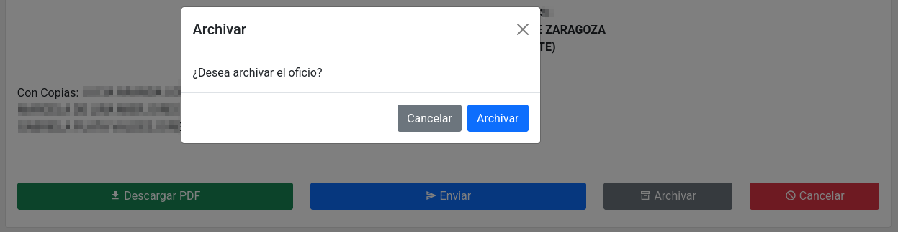

## Plantillas

Una plantilla es un formato para crear un nuevo oficio que se usa frecuentemente. Puede solicitar a la Dirección de Informática la elaboración de sus plantillas proporcionando un archivo para basarse levantando un ticket de soporte técnico. No deje de especificar una correcta descripción para que todos los usuarios lo encuentren.

Las plantillas pueden sólo del propietario o compartidas. Una plantilla compartida le aparece a todos los usuarios cuando vayan a hacer un nuevo oficio. También se pueden archivar para retirarlas de forma temporal o permanente.
